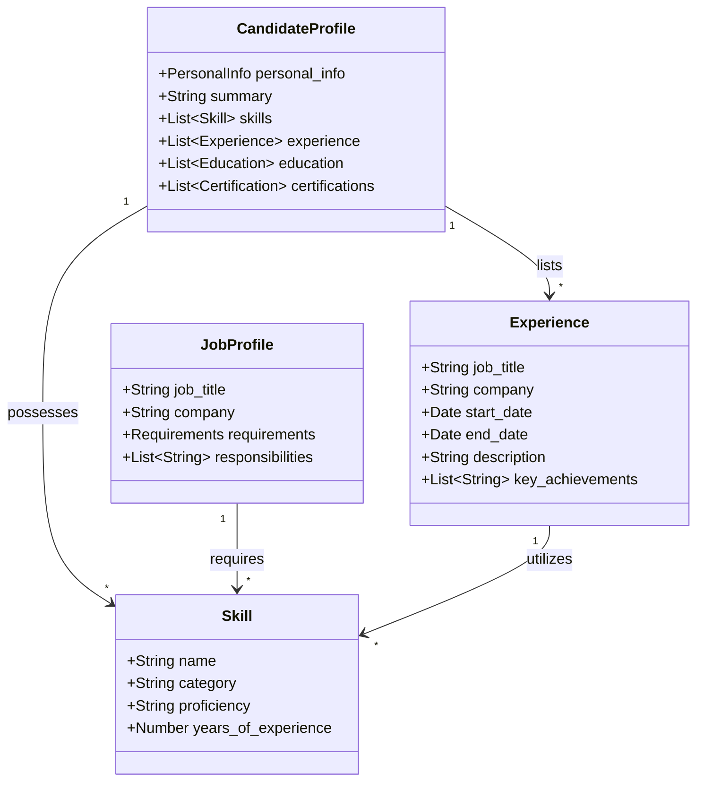

# Data Entity Design: Hiring Intelligence System

This document outlines the core data entities and their relationships within the Zecpath AI hiring intelligence system. These entities are designed to facilitate high-performance AI-driven screening, scoring, and candidate-job matching.

## 1. Core AI Data Entities

### A. Candidate Profile
The `Candidate Profile` is the primary object representing a person's professional background. It is typically extracted from a resume (PDF/Docx).

- **Purpose**: To provide a structured, machine-readable view of a candidate's potential.
- **Key Components**:
    - **Personal Info**: Standard contact and identifying details.
    - **Summary**: A high-level professional narrative.
    - **Skills**: A list of `Skill Objects` (Technical, Soft, etc.).
    - **Experience**: A collection of `Experience Objects` representing career history.
    - **Education**: Details of academic qualifications.
    - **Certifications**: Professional credentials.

### B. Job Profile
The `Job Profile` represents the requirements and details of a specific job opening.

- **Purpose**: To serve as the "ground truth" for matching candidates against specific roles.
- **Key Components**:
    - **Job Info**: Title, company, location, and type.
    - **Requirements**: Mandated skills, experience levels, and education.
    - **Responsibilities**: The core tasks the role entails.

### C. Skill Object
A `Skill Object` is a granular representation of a specific competency.

- **Attributes**:
    - **Name**: The skill identifier (e.g., "Python", "Project Management").
    - **Category**: Classifies the skill (Technical, Soft, Domain, Tool).
    - **Proficiency**: An assessment level (Beginner, Intermediate, Expert).
    - **Years of Experience**: Quantitative measure of tenure with the skill.

### D. Experience Object
An `Experience Object` captures a specific tenure at a company.

- **Attributes**:
    - **Job Title / Company**: Identifies the role.
    - **Timeline**: Start and end dates.
    - **Description**: Narrative of responsibilities.
    - **Key Achievements**: Quantitative or qualitative highlights (bullets).

---

## 2. Entity Relationships

The following Mermaid diagram illustrates the relationships between these core entities:

- **Candidate to Skill**: A candidate "possesses" multiple skills.
- **Candidate to Experience**: A candidate's profile is composed of multiple "Experience" tenures.
- **Job to Skill**: A job "requires" a set of skills (mandatory or preferred).
- **Experience to Skill**: Proficiency in specific skills is often demonstrated through "Experience".

---

## 3. Rationale for AI Systems

### Why this structure is useful:

1.  **Standardization**: By forcing diverse resume formats into a unified JSON structure, AI models can consistently process and compare candidates.
2.  **Semantic Matching**: Separating skills from narrative experience allows for both keyword-based and semantic (LLM-based) matching.
3.  **Scoring & Ranking**: Having quantitative fields (years of experience, proficiency) enables automated scoring algorithms to rank candidates against JD requirements.
4.  **Granularity**: The `Experience Object` breaks down a career into chunks, making it easier for AI to analyze career progression and trajectory.
5.  **Extensibility**: The metadata fields allow for tracking model confidence scores and extraction dates for lineage and auditing.
